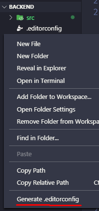

# RocketFlix
<br/>
<h3 align="center" style="font-weight: bold">
Este repositório tem o objetivo de criar uma plataforma de videos, em Node.Js e ReactJs, para a empresa ! 🚀
</h3>

<div><br />

## [Rocketseat](https://www.github.com/Rocketseat)

</div>

<hr />

## Visão global

Este projeto tem um papel fundamental para a aprendizagem entre desenvolvedores e é para isso que existe a comunidade. Foi pensado exclusivamente para construirmos juntos um ambiente bem parecido com o aplicativo Netflix, com funcionalidades de videos lançados no momento, playlists, notificações, testes automatizados e muitas outras coisas que você poderá aplicar durante o seu desenvolvimento.

Para melhor exemplificar o projeto, será separado em tópicos, falando exclusivamente sobre, para manter a fluidez e facilidade, tendo um maior conforto para ambos, seja backend, ou frontend.

````
Nota:

  É importante ressaltar que este projeto, não tem o objetivo de ir para a produção, caso você queira colocar, é necessário que você fale diretamente com a Rocketseat. Não nos responsabilizamos por nada que você faça. 
````
<hr />

## Tabela de conteúdo

- [Ferramentas](#ferramentas)
  - [Backend](#backend)
    - [Introdução](#introdução-em-backend)
    - [Desenvolvimento](#Desenvolvimento-em-backend)
  - [Frontend](#frontend)
    - [Introdução](#introdução-em-frontend)
    - [Desenvolvimento](#Desenvolvimento-em-frontend)
  - [Avançadas](#avançadas)
    - [Eslint](#eslint)
    - [Prettier](#prettier)
    - [Editorconfig](#editorconfig)
- [Contribuição](#contribuição)
- [Licença](#licença)

<hr />

## Ferramentas

As ferramentas que serão usadas e aplicadas durante o desenvolvimento, serão diversas e idependentes para cada visão. Para o backend usaremos o `Node.js`, ele hoje sendo umas das referências. Já para o frontend usaremos o `ReactJs`, por ser uma plataforma bem favorável a nossa aplicação, será de grande ajuda o desenvolvimento nessa ferramenta do `React`.

<hr />

### Backend

### Introdução em Backend

Primeiramente cada projeto, possui uma ierarquia de pastas e você deve seguir para não se perder durante o seu desenvolvimento.

````
src/
┣ app/
┃   ┗ models/
┃     ┗ User.js
┣ config
┃   ┗ database.js
┗ database/
     ┣ migrations/
     ┗ index.js
````
Aqui você precisará entender como funciona o fluxo, porque este é o seu ponto de partida para começar a programar em Nodejs.

A pasta **src** será o armazenador do código fonte, pois encapsulará toda a regra de negócio e não somente em um arquivo só arquivo. De início, você irá possuir um arquivo chamado de **src/app.js**, onde foi indicado o inicio das rotas, middlewares e a captação de exeções da aplicação. É importante ressaltar, que a mesma estará rodando na porta `3333`, para caso você esteja usando ela, em algum momento, sugiro parar todos os processos em execução sendo do software node, para não dar nenhum conflito.

**Windows:**
```sh
$ taskkill /f /im node.exe
```

**Linux:**
```sh
$ killall -9 node
```

**Mac:**
```sh
$ killall -9 node
```

Caso não deu certo, siga este tutorial para o encerramento do processo: [Killall node](https://stackoverflow.com/questions/14790910/stop-all-instances-of-node-js-server)

- o arquivo que se encontra no caminho `./nodemon.json`, ele é responsável para configurar a dependência nodemon, caso queira executar um arquivo javascript, ele automaticamente, troca o path `nodemon` para `sucrase-node`, deixando muito mais performático a inicialização do servidor.

- **app** - na pasta app, guardará a regra de negócio da sua aplicação, sendo assim, pode-se conter dentro de pastas: `controllers`, `models`, `middlewares` e entre outros.

- **config** - na pasta config, armazena todo e qualquer tipo de configuração, seja ela do banco de dados, emails, filas, entre outras.

- **database** - na pasta database, está sendo armazenado configurações de conexão entre models e as migrations do banco de dados, ou seja, para esse projeto está sendo usado o `sequelize-cli` para gerenciar e o dialeto é o `postgresql`.

- Já para configurar o sequelize, existe um arquivo chamado `.sequelizerc`, tendo o objetivo de encontrar o caminho para a configuração do banco de dados, dos models, das migrations e seeders!

- O arquivo que se encontra em `~/config/database.js`, ele é responsável para configurar o banco de dados, dizer que dialeto, nome do banco de dados, username, senha e host e algumas definições.

- o arquivo que se encontra no caminho `~/routes.js`, ele é responsável pelas rotas da aplicação, sendo assim muito importante para o processo de manipulação dos dados.


### Desenvolvimento em Backend

Dando um introdutório e sabendo o que cada coisa faz e como gerenciar os seus arquivos, aqui você vai partir para o desenvolvimento onde encontrará comandos e códigos, que você poderá usar.

Inicialmente você poderá usar os seguintes comandos para usar na aplicação, onde são gerenciados através do **package.json** na propriedade `scripts`:

- dev - Para quando querer que o servidor fique ouvindo as alterações e seja restartado.
- start - Para que o servidor seja startartado uma vez.
- test - Para caso você esteja realizando testes para a aplicação.

Mas antes de sair codando, é necessário que você instale as dependências que já estão inseridas no projeto.

Neste projeto está sendo utilizado o gerenciador de pacotes [yarn](https://yarnpkg.com/en/docs/install#debian-stable), onde você poderá instalá-lo, para que não crie problemas futuros.

Depois que instalar o gerenciador, execute este comando na pasta do projeto `backend`:

```sh
$ yarn
```

Agora que instalado as dependências, você criará um container no docker, porque foi pensado nisso como forma de aprendizado, caso não possua o [docker](https://docs.docker.com/) instalado em sua maquina, será necessário estar instalado, pois você precisará criar um container assim como foi pensado anteriormente pelo gerenciamento deste projeto.

Com o docker instalado na sua máquina, para criar um container que será usado para este projeto, será feito o seguinte comando: 

```sh
$ docker run --name database -e POSTGRES_PASSWORD=docker -p 5432:5432 -d postgres
```

A senha poderá mudar de acordo com o que você definir.

E antes de inicializar o container será preciso indicar algumas configurações feitas por você no arquivo `.env`, este arquivo você criará na pasta `backend` e deverá ser seguido a mesma configuração que está no arquivo de exemplo: `.env.example`. Lembrando que o arquivo `.env` não poderá entrar neste repositório online, para manter os dados sensíveis da aplicação somente local.

Tranquilo, agora você pode rodar o container executando o comando:

```sh
$ docker start database
```

Agora com o docker rodando, você poderá inicializar o desenvolvimento e rodar o servidor localmente, executando:

```sh 
$ yarn dev
```

Fazendo isso, você poderá dar início a sua jornada de desenvolvimento. Se caso você sofrer com algum erro, ou não conseguir colocar uma certa configuração em seu projeto, sugiro abrir uma [issue](https://github.com/DanielDavidDev/rocketflix/issues), para que se caso outros desenvolvedores sofrerem com este mesmo problema, sejá mais fácil encontrar a solução.

Se você sentir a necessidade, ou queira modificar este arquivo de `README.md`, você poderá fazer isso caso seja uma boa forma de ser documentado. Presumo que você possa ser muito útil para nos ajudar a deixar ainda mais legível essa documentação para outros desenvolvedores.

<hr />

### Frontend

### Introdução em Frontend

Primeiramente cada projeto, possui uma ierarquia de pastas como vimos no backend e você deve seguir para não se perder durante o seu desenvolvimento.

````
public
┣ index.html
src
┣ components
┃   ┗ Header
┣ pages
┃   ┣ _layouts
┃   ┗ SignIn
┣ routes
┗ styles
     ┗ global.js
````

Aqui você precisará entender como funciona o fluxo, porque que este é o seu ponto de partida para começar a programar em ReactJs.

Primeiramente você encontrará a pasta **public**, para muitos essa é uma pasta um tanto que desnecessária, mas ela concerteza tem muito o que precisamos saber, sendo assim, uma referência do início da aplicação. Se você abrir o arquivo `index.html`, você encontrará um HTML, simples que no corpo dele terá uma tag `div` com uma classe `root`, essa classe é onde o seu código em React será importado, então se você achou que não é importante ele pode dizer muita coisa sobre.

Inicialmente, foi definido que não será utilizado PWA para este projeto, por isso foi deixado bem configurado e simplificado o arquivo em questão.

Agora na pasta **src** será o armazenado todo código fonte, pois encapsulará todas as telas que terão neste projeto, tendo configurações também e componentes que serão adicionados com o tempo.

- o arquivo que se encontra no caminho `./jsconfig.json`, ele é responsável para configurar a parte de importação de arquivos dentro do projeto, sendo assim, muito ruim estar colocando vários `../../` para voltar pastas. Então, foi criado essa funcionalidade para que a referência `src`, onde será armazendado o código, será o root path, para importação de arquivos.

- **App.js** - este arquivo é responsável para encapsular as rotas e configurações adicionais ao projeto.

- **components** - na pasta components, ele basicamente encapsula os componentes que você criará para o projeto, sendo assim muito importante.

- **pages** - na pasta pages, basicamente é armazenado as telas e layouts da aplicação.

- **routes** - na pasta routes, é configurado as rotas privadas e públicas da aplicação, aqui é onde você incluirá as pages em rotas.

- **styles** - na pasta styles, basicamente são os estilos globais que a aplicação terá, ou seja, caso, você utilize tal estilização demais em um elemento, você poderá incluir no arquivo `global.js`, as estilizações adicionais.

### Desenvolvimento em Frontend

Dando um introdutório e sabendo o que cada coisa faz e como gerenciar os seus arquivos, aqui você vai partir para o desenvolvimento onde encontrará comandos e códigos, que você poderá usar.

Inicialmente você poderá usar os seguintes comandos para usar na aplicação, onde são gerenciados através do **package.json** na propriedade `scripts`:

- start - Para que o front seja startartado.

Mas antes de sair codando, é necessário que você instale as dependências que já estão inseridas no projeto.

Neste projeto está sendo utilizado o gerenciador de pacotes [yarn](https://yarnpkg.com/en/docs/install#debian-stable), onde você poderá instalá-lo, para que não crie problemas futuros.

Depois que instalar o gerenciador, execute este comando na pasta do projeto `frontend`:

```sh
$ yarn
```

Agora que instalado as dependências, você iniciará o container, que já foi instalado logo na sessão [desenvolvimento em backend](#desenvolvimento-em-backend) se caso não fez isso, pesso para que volte duas casas e faça o processo. Exucutando o comando:

```sh
$ docker start database
```

Você precisa startar o backend, mesmo ainda em desenvolvimento, você sairá da pasta `frontend` e entrará na pasta `backend`, para ficar mais fácil, deixarei um comando pronto se estiver na pasta informada:

```sh
$ cd .. && cd backend/ && yarn
```

Isso fará com que instale as dependências que estão no projeto, agora você pode incializar o container e a api.

Mas antes de inicializar o container e a api será preciso indicar algumas configurações feitas por você no arquivo `.env`, este arquivo você criará na pasta `backend` e deverá ser seguido a mesma configuração que está no arquivo de exemplo `.env.example`. Lembrando que o arquivo `.env` ele, não poderá entrar neste repositório online, para manter os dados sensíveis da aplicação somente local.

Logo após a edição do arquivo colocando as suas configurações da aplicação, você poderá inicializar o container do docker e a api:

```sh 
$ docker start database && yarn dev
```

Agora com o docker rodando, você poderá inicializar o desenvolvimento do frontend, seguindo um layout que ainda não foi desenvolvido, caso queira fazer, é só você abrir uma issue e commitar as alterações, elas serão primeiramente apreciadas e logo depois importada aqui para que todos que estiverem desenvolvendo o frontend, consiga seguir um layout padrão.

Lembrando se caso você sofrer com algum erro, ou não conseguir colocar uma certa configuração em seu projeto, sugiro abrir uma [issue](https://github.com/DanielDavidDev/rocketflix/issues), para que se caso outros desenvolvedores sofrerem com este mesmo problema, sejá mais fácil encontrar a solução.

Se você sentir a necessidade, ou queira modificar este arquivo de `README.md`, você poderá fazer isso caso seja uma boa forma de ser documentado. Presumo que você possa ser muito útil para nos ajudar a deixar ainda mais legível essa documentação para outros desenvolvedores.

<hr />

## Avançadas

Foi separado este tópico, porque basicamente isso funciona para qualquer tipo de visão, onde estará o backend e o frontend. Essas funcionalidades serão descritas rapidamentes, pois elas não são um requisito para o projeto, mas para uma boa usabilidade e ter um padrão único para o projeto, é interessante passar um tópico justamente para falar de cada uma delas.

### Eslint

O eslint basicamente, ele gerencia melhor o código para seguir um padrão mais aceito e marcar erros onde você poderá modificar para uma forma melhor de usar. Ele tem uma [extenção](https://marketplace.visualstudio.com/items?itemName=dbaeumer.vscode-eslint) no [vscode](https://code.visualstudio.com/#alt-downloads), se caso não ter este software, recomendo estar utilizando ele, pois ajudará muito no decorrer de seu desenvolvimento, mas se você já tiver com outro editor em sua máquina e tiver um costume já com ele, não terá maiores problemas, mas apartir daqui não funcionará as configurações do editor que mostrarei aqui.

Para melhor configuração dessa ferramenta e integrar bem ao editor, você poderá colocar as seguintes configurações no arquivo `settings.json`, que você encontrará, clicando em `CTRL + SHIFT + P`, com isso abrirá um input de texto logo no header do editor, daí então, você incluirá o seguinte: `>Preferences: Open Settings (JSON)`, com isso abrirá suas configurações e incluirá no Json, o seguinte:

```json
{
  ...
  "editor.formatOnSave": false,

  "eslint.autoFixOnSave": true,
  "eslint.validate": [
    {
      "language": "javascript",
      "autoFix": true
    },
    {
      "language": "javascriptreact",
      "autoFix": true
    }
  ]
}
```

O spread operator foi indicado logo no começo, por você ter ainda outras configurações já modificadas, então, logo depois delas, poderá indicar o que foi colocado acima.

### Prettier

Esta ferramenta se chama `prettier` e também possui uma [extenção](https://marketplace.visualstudio.com/items?itemName=esbenp.prettier-vscode), sendo de grande importância, estar instalando também, para que ele possa arrumar o seu código e assim ter uma integração com o eslint, tendo mais compatibilidades e metodologias aplicadas em seu projeto.

Ele tem uma configuração no vscode que você poderá adicionar também:

```json
{
  ...
  "prettier.eslintIntegration": true,
}
```

Da mesma forma que na sessão [eslint](#eslint), o spread operator foi indicado, porque você pode ter outras configurações neste documento, por isso você incluirá, depois delas.

### Editorconfig

Essa Ferramenta é uma ótima opção caso você esteja lidando com outras devs que usam outros editores, ele basicamente configura entre todos os editores a forma de como são editados os arquivos, em questão de espaçamento, se pula uma linha no final o código e entre outras coisas que você pode estar olhando a documentação. Ele possui uma [extensão](https://marketplace.visualstudio.com/items?itemName=EditorConfig.EditorConfig), para que ao clicar com o botão direito do mouse no navbar onde não possui arquivos mostre uma opção que gere um arquivo de configuração do mesmo.



As configurações usadas nestes projetos como um todo são:

```
root = true

[*]
indent_style = space
indent_size = 2
end_of_line = lf
charset = utf-8
trim_trailing_whitespace = true
insert_final_newline = true
```

## Contribuição

Antes de sair codando, você precisa fazer um passo a mais para se registrar nesse projeto como contribuidor :)

Escolha qual projeto vai utilizar para desenvolvimento, vou supor que você está em `backend`, então você entrará no arquivo **package.json**, nele você vai encontrar uma propriedade chamada de `contributors`, e adicione o seu nome, url e email(opcional).

```json
"contributors": [
  {
    "name": "seu nome",
    "email": "seu email",
    "url": "htpps://github.com/seu_usuario"
  }
]
```

É importante que você não mexa nos nomes de seus colegas, caso isso aconteça, **não será aceito a pull request**.


Contribuições são o que fazem a comunidade open source um lugar incrível para aprender, inspirar e criar. Qualquer contribuição que você fizer, será **muito apreciada**.

1. Faça um Fork do projeto
2. Crie uma Branch para sua Feature (`git checkout -b feature/FeatureIncrivel`)
3. Adicione suas mudanças (`git add .`)
4. Comite suas mudanças (`git commit -m 'Adicionando uma Feature incrível!`)
5. Faça o Push da Branch (`git push origin feature/FeatureIncrivel`)
6. Abra uma Pull Request

# Licença

MIT
